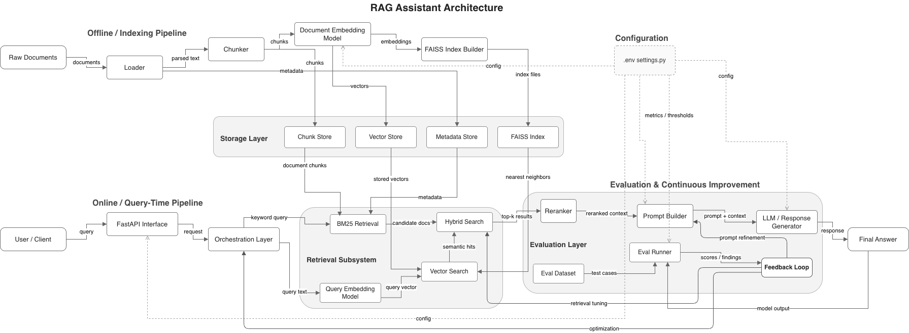
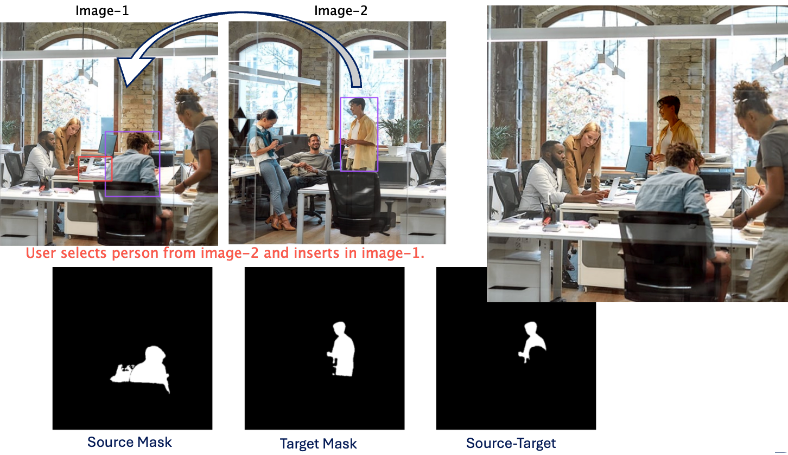

# AI - Product Portfolio
My current focus is creating AI products that integrate seamlessly into workflow ecosystems—LLM agents, intelligent recommendations, automated decisioning, and hybrid human-in-the-loop systems that improve accuracy, reduce friction, and scale safely. I’m particularly interested in opportunities at the intersection of AI systems, platform modernization, and regulated, mission-critical operations.

## Education
- M.S., Artificial Intelligence - University of Pennsylvania (Upenn)
- M.S., Computer Science - University of Pennsylvania (Upenn)

 

# Projects

   <h3 class="section-title" style="color:#507d2a;">Project I. RAG Assistant</h3>
  <h4>A LLM-powered Retrieval System</h4>
  
  

    A modular <strong>Retrieval-Augmented Generation (RAG) system</strong> designed to simulate real-world AI product architecture — combining search, ranking, observability, caching, and feedback-driven improvement.
  

  

    This project demonstrates how LLM systems evolve into <strong>production-style pipelines</strong> with measurable performance and iterative learning.
  

  <h3 class="section-title">Key Capabilities</h3>

  

    
Hybrid Retrieval <small>FAISS + BM25</small>

    
Reranking Layer <small>Improved relevance</small>

    
LLM Generation <small>Context-aware answers</small>

    
Observability <small>Latency + diagnostics</small>

    
Caching <small>Fast repeat queries</small>

    
Feedback Loop <small>Ranking improvement</small>

  

  <h3 class="section-title">Why this matters</h3>

  <ul>
    <li>Measure <strong>retrieval quality</strong> instead of guessing</li>
    <li>Balance <strong>latency vs accuracy</strong></li>
    <li>Improve results via <strong>user feedback</strong></li>
    <li>Design <strong>production-ready LLM systems</strong></li>
  </ul>

  <h3 class="section-title">System Design</h3>

  <ul>
    <li>Separate pipelines: ingestion → retrieval → generation</li>
    <li>Provider abstraction (extensible)</li>
    <li>Modular, scalable architecture</li>
    <li>Built with <strong>system thinking</strong></li>
  </ul>

  <h3 class="section-title">Project Links</h3>

  

    

      <strong>Full System</strong> 
      <a href="https://github.com/abhishekbhor/rag-assistant" target="_blank">
        View Repository
      </a>
    

    

      <strong>Deep Dive</strong> 
      <a href="https://github.com/abhishekbhor/rag-assistant/blob/main/README.md" target="_blank">
        System Documentation
      </a>
    

  

  <h3 class="section-title">Tech Stack</h3>

  

    Python
    FastAPI
    FAISS
    BM25
    OpenAI
  

 

 

  <h3 class="section-title" style="color:#507d2a;">Project II. Big Data Analysis & Prediction</h3>
  <h4>Indicators of Heart Disease</h4>

  

  

    <a href="https://medium.com/@nkoro/heart-health-education-is-there-something-were-missing-ee41292c7729" target="_blank"><strong>The study</strong></a>
    used machine learning models such as Random Forest and oversampling techniques like SMOTE to analyze 2022 CDC data and identify the strongest predictors of heart attacks. It found that while age and angina were primary factors, unexpected variables such as dental health also had meaningful predictive value.
  

  <h3 class="section-title">Key Capabilities</h3>

  

    
Data Cleaning & Wrangling <small>Pandas + NumPy</small>

    
EDA & Visualization <small>Matplotlib + Seaborn</small>

    
Classification Models <small>Logistic Regression, Decision Tree, Random Forest</small>

    
Class Imbalance Handling <small>SMOTE</small>

    
Feature Engineering <small>Encoding + feature pruning</small>

    
Model Evaluation <small>Precision, Recall, F1, ROC/AUC</small>

  

  <h3 class="section-title">Tools & Libraries</h3>

  <ul>
    <li><strong>Python</strong> — primary programming language used for analysis and modeling</li>
    <li><strong>Scikit-learn</strong> — model training, evaluation, and ML pipelines</li>
    <li><strong>Pandas & NumPy</strong> — cleaning, transformation, and structured analysis</li>
    <li><strong>Matplotlib & Seaborn</strong> — EDA, correlation plots, and statistical visualization</li>
  </ul>

  <h3 class="section-title">Models Evaluated</h3>

  <ul>
    <li><strong>Logistic Regression</strong> — baseline model</li>
    <li><strong>Decision Tree Classifier</strong> — improved recall and interpretability</li>
    <li><strong>Random Forest Classifier</strong> — strongest performer with ~97% accuracy and high AUC</li>
  </ul>

  <h3 class="section-title">Data Engineering & Analytics Techniques</h3>

  <ul>
    <li><strong>SMOTE</strong> — addressed the imbalanced dataset problem by generating synthetic minority samples</li>
    <li><strong>One-Hot Encoding & Label Encoding</strong> — converted categorical variables into model-ready numerical features</li>
    <li><strong>Dendrograms / Hierarchical Clustering</strong> — used to identify and remove redundant correlated features</li>
    <li><strong>Evaluation Metrics</strong> — confusion matrix, recall, precision, F1 score, and ROC/AUC</li>
  </ul>

  <h3 class="section-title">Data Source</h3>

  

    <strong>2022 CDC Annual Survey</strong> 
    Specifically the <em>Key Indicators of Heart Disease</em> dataset, which provided the raw data across 40+ variables used in the analysis.
  

<!--                                                                -->

 

 

  <h3 class="section-title" style="color:#507d2a;">Project III. Multi-Modal Image Synthesis</h3>
  <h4>No Cameraman Left Behind</h4>

  

  

    An interactive image synthesis system designed to let a user select a “cameraman” from one image and insert that person into a second scene, while preserving realistic foreground/background relationships. The goal was to make the workflow intuitive enough that the user would not need to manually tune mask geometry or blending parameters. 
  

  

    The project explored segmentation, mask composition, and blending strategies to support realistic insertion in everyday scenarios such as family photos, cooking activities, classrooms, studios, and office settings.
  

  <h3 class="section-title">Problem & Product Goal</h3>

  <ul>
    <li>Allow a user to select the cameraman from a complex real-world scene</li>
    <li>Insert that person into another complex scene with minimal manual effort</li>
    <li>Preserve object layering so the inserted subject can appear behind foreground objects in the target image</li>
    <li>Reduce user burden by avoiding low-level mask and configuration tuning</li>
  </ul>

  <h3 class="section-title">Solution Workflow</h3>

  

    
User imports source image <small>Person to extract</small>

    
User imports target image <small>Scene to insert into</small>

    
User draws bounding boxes <small>Interactive object selection</small>

    
System generates composite masks <small>Per-object mask combination</small>

    
System computes final mask <small>Source mask − target mask</small>

    
System blends final image <small>Preserves occlusion relationships</small>

  

  <h3 class="section-title">Key Capabilities</h3>

  

    
Interactive Segmentation <small>Meta SAM2 mask prediction</small>

    
Multi-object Selection <small>Bounding-box based selection</small>

    
Composite Masking <small>Combines multiple selected masks</small>

    
Occlusion-aware Insertion <small>Places source behind target objects</small>

    
Image Blending <small>OpenCV interpolation-based blending</small>

    
User-friendly Workflow <small>Reduced manual parameter tuning</small>

  

  <h3 class="section-title">Technologies & Design Choices</h3>

  <ul>
    <li><strong>Meta SAM2</strong> for image segmentation</li>
    <li><strong>Mask Predictor</strong> was chosen over Automatic Mask Detector because the automatic detector segmented too many objects and forced excessive user choice</li>
    <li><strong>Bounding-box selection</strong> was preferred because it allowed a user to select multiple objects more intuitively</li>
    <li><strong>Jupyter BBox Widget</strong> enabled interactive multi-object selection</li>
    <li><strong>OpenCV linear interpolation</strong> was selected for blending</li>
  </ul>

<!--
    

      <h3 class="section-title">Why These Choices Mattered</h3>
    
      <ul>
        <li><strong>Automatic Mask Detection</strong> was rejected because it segmented every visible object separately, which increased user effort</li>
        <li><strong>SAM2 Mask Predictor with one click</strong> still required users to choose among multiple mask score options</li>
        <li><strong>SAM2 + bounding boxes</strong> solved that by letting users deliberately choose the desired object(s)</li>
        <li><strong>Multiple bounding boxes</strong> enabled the system to create separate masks and combine them into a composite mask</li>
      </ul>
    

-->

  <h3 class="section-title">Core Technical Insight</h3>

  

    A central idea in the project was:
  

  

    <strong>Final Mask = Source Mask − Target Mask</strong>
  

  

    This allowed the inserted source subject to appear behind selected target objects, which was necessary for more realistic compositing. 
  

  <h3 class="section-title">Challenges Encountered</h3>

  <ul>
    <li><strong>Blending with <code>cv2.seamlessClone</code></strong> produced unpredictable positioning because the center was inferred from mask geometry rather than intended image placement</li>
    <li><strong>Incorrect blending artifacts</strong> included ghosting, excess source background, and darkening of the target or source subject</li>
    <li><strong>Composite mask tuning</strong> required refinement where source and target masks intersected</li>
    <li><strong>Mask resizing</strong> caused further issues, so the solution kept original image sizes and only reduced display size for easier box drawing</li>
    <li><strong>GPU cost</strong> limited exploration of larger SAM2 variants</li>
    <li><strong>Image quality constraints</strong> came from relying on free stock images with stamps and imperfect resolution</li>
  </ul>

<!--
    

      <h3 class="section-title">Scenarios & Results</h3>
    
      <ul>
        <li>Solid background insertion</li>
        <li>Solid background with two source objects</li>
        <li>Classroom setting with partial occlusion</li>
        <li>Studio setting with foreground objects</li>
        <li>Office group setting</li>
      </ul>
    

    
    

      <h3 class="section-title">Why this project matters</h3>
    
      <ul>
        <li>Shows how user experience constraints shape technical choices in computer vision systems</li>
        <li>Demonstrates system thinking across segmentation, interaction design, mask logic, and blending</li>
        <li>Highlights tradeoffs between automation and controllability</li>
        <li>Treats image synthesis as a pipeline problem, not just a model problem</li>
      </ul>
    

-->

  <h3 class="section-title">Tech Stack</h3>

  

    Python
    Meta SAM2
    Jupyter BBox Widget
    OpenCV
    Google Colab
  

 

